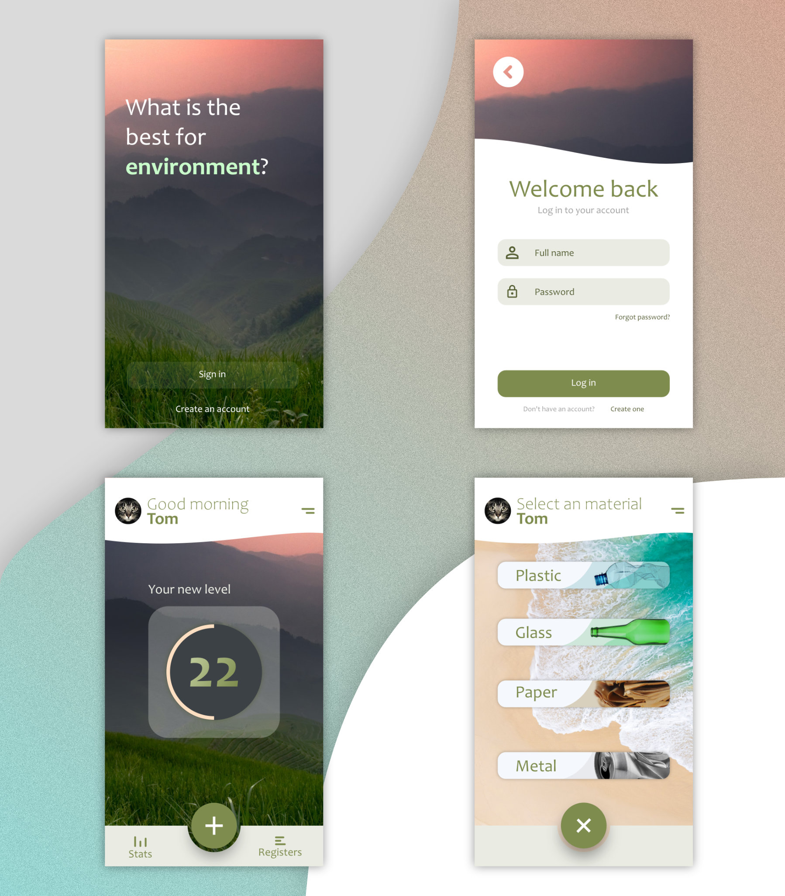

# ProjectGreen

 
 

<table>
  <caption>Ομάδα 28</caption>
    <tr>
        <th>Τζήκα</th>
        <th>Μπαλατσού</th>
        <th>Φουλίδης</th>
        <th>Χαϊντάρι</th>
        <th>Χαμαλίδης</th>
        <th>Τσερκέζη</th>
    </tr>
    <tr>
        <td>Δήμητρα</td>
        <td>Αργυρώ</td>
        <td>Δημήτριος</td>
        <td>Εριόλα</td>
        <td>Σωτήριος Βασίλειος</td>
        <td>Ιωάννα</td>
    </tr>
    <tr>
        <td colspan="6">Πανεπιστήμιο Μακεδονίας - University of Macedonia</td>
    </tr>
    <tr colspan="6">
        <td colspan="6">Τμήμα Εφαρμοσμένης Πληροφορικής - Department of Applied Informatics</td>
    </tr>
</table>
 

> One of the priorities of the European Union is sustainability and saving resources. In this context, an application was created which will allow users to drop off items for recycling and receive rewards through a points system.

## Agile-Scrum

 - 15/04/2024

## <a href="https://mit-license.org/">The MIT License (MIT)</a>

Copyright © 2024 Bill Chamalidis, Dimidtra Tzika, Argyro Balatsou, Dimitrios Foulidis, Eriola Hajdari, Ioanna Tserkezi

Permission is hereby granted, free of charge, to any person obtaining a copy of this software and associated documentation files (the “Software”), to deal in the Software without restriction, including without limitation the rights to use, copy, modify, merge, publish, distribute, sublicense, and/or sell copies of the Software, and to permit persons to whom the Software is furnished to do so, subject to the following conditions:

The above copyright notice and this permission notice shall be included in all copies or substantial portions of the Software.

THE SOFTWARE IS PROVIDED “AS IS”, WITHOUT WARRANTY OF ANY KIND, EXPRESS OR IMPLIED, INCLUDING BUT NOT LIMITED TO THE WARRANTIES OF MERCHANTABILITY, FITNESS FOR A PARTICULAR PURPOSE AND NONINFRINGEMENT. IN NO EVENT SHALL THE AUTHORS OR COPYRIGHT HOLDERS BE LIABLE FOR ANY CLAIM, DAMAGES OR OTHER LIABILITY, WHETHER IN AN ACTION OF CONTRACT, TORT OR OTHERWISE, ARISING FROM, OUT OF OR IN CONNECTION WITH THE SOFTWARE OR THE USE OR OTHER DEALINGS IN THE SOFTWARE.

**About:**

 - Created: 1 Apr 2024
 - Version: 0.0.1
 - Thessaloniki 2024 6th semester UOM

## Android Studio Version

[Android Studio Flamingo | 2022.2.1 Patch 2](https://developer.android.com/studio/archive)
Build #AI-222.4459.24.2221.10121639, built on May 12, 2023
Runtime version: 17.0.6+0-b2043.56-9586694 amd64
VM: OpenJDK 64-Bit Server VM by JetBrains s.r.o.
Windows 11 10.0
GC: G1 Young Generation, G1 Old Generation
Memory: 1280M
Cores: 8
Registry:
    external.system.auto.import.disabled=true
    ide.text.editor.with.preview.show.floating.toolbar=false
    gradle.version.catalogs.dynamic.support=true

### Libraries that used in the project

 - com.google.firebase:firebase-auth:21.0.3
 - com.google.firebase:firebase-firestore:24.4.1
 - com.daimajia.easing:library:2.4@aar